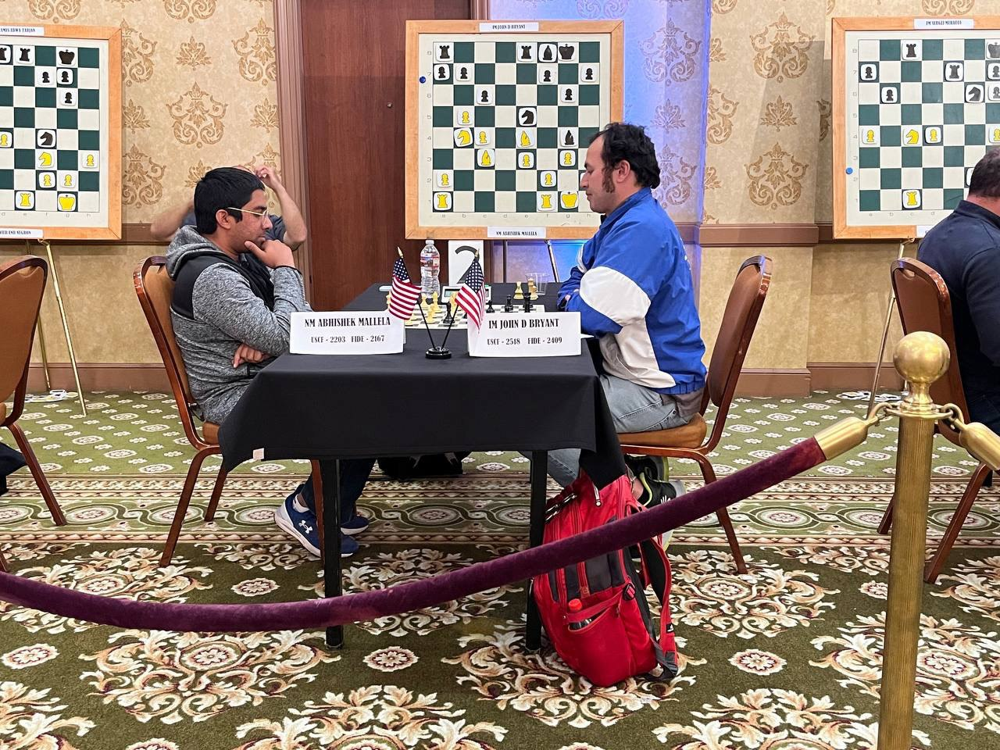
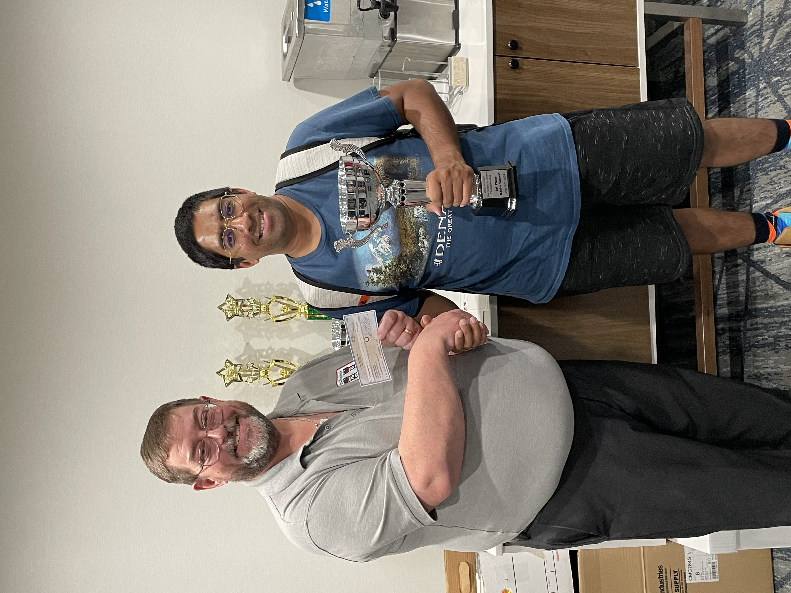
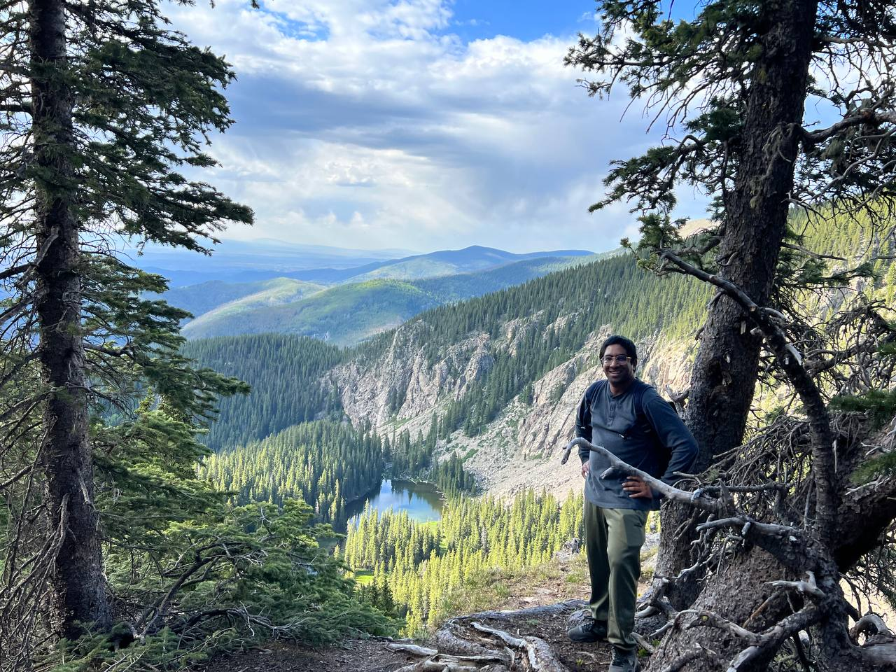
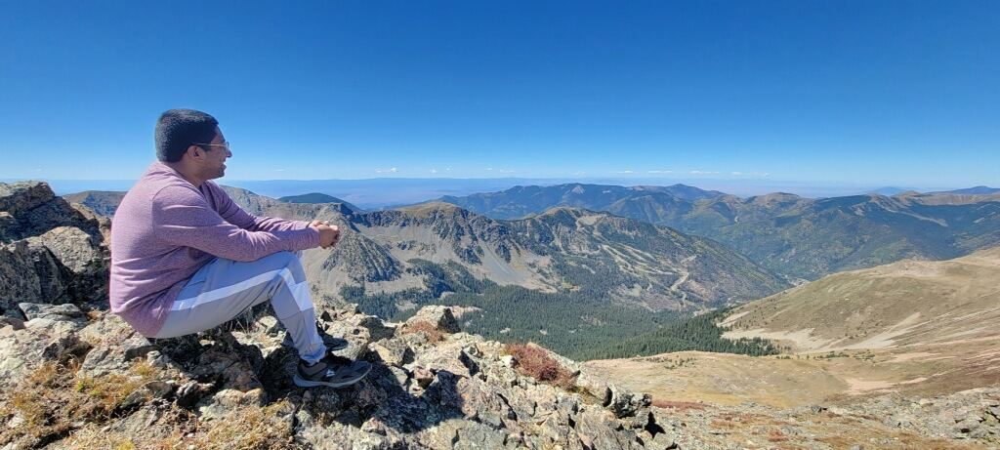
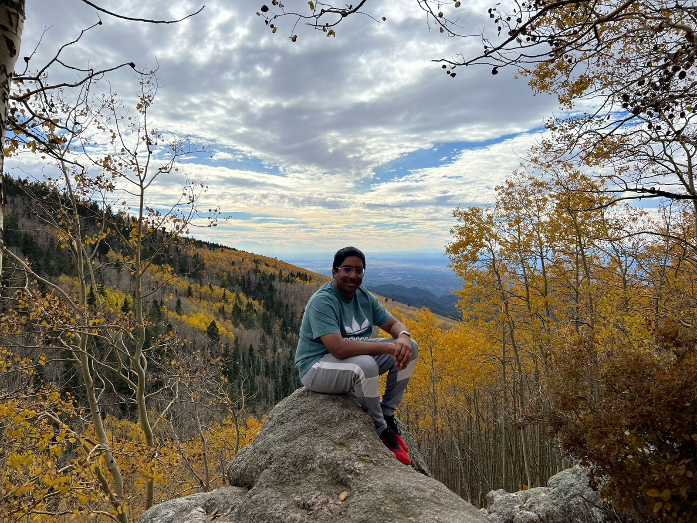
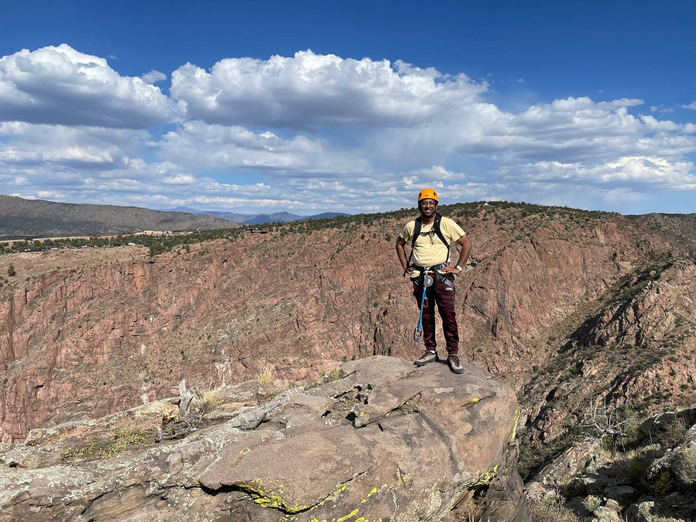
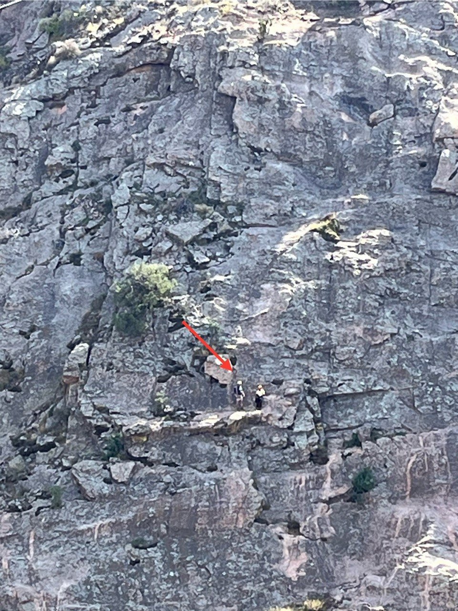
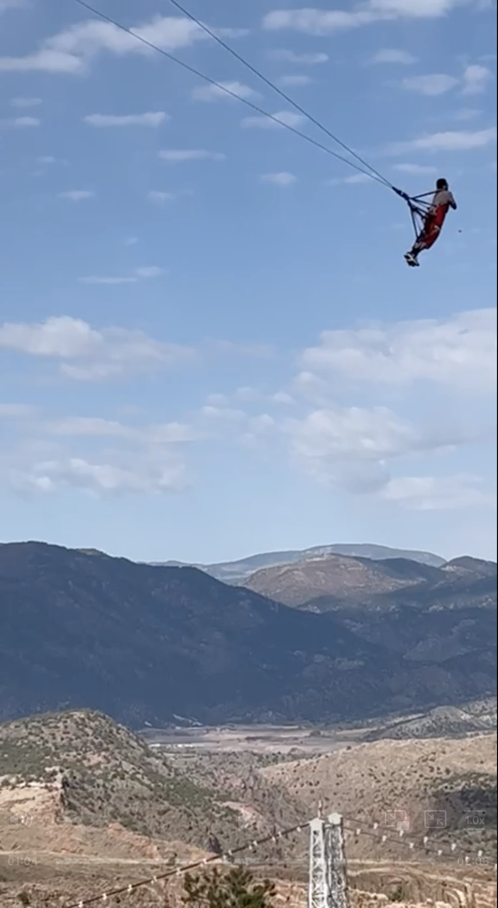

In addition to my academic background, I have had the chance to participate in many activities. To mention a couple of them, I enjoy competitive chess and outdoor activities including hiking, mountain climbing, and other adventures.

<link rel="stylesheet" type="text/css" href="../assets/css/main.css">
<h2 style="text-align: left; margin-top: 20px;">Chess</h2>

  
  

I am a <a href="https://www.uschess.org/msa/MbrDtlMain.php?12888811">US National Master</a>, a title awarded to less than 2% of competitive chess players in the US. Over the course of my competitive career, I have won several state open championships as well as numerous local tournaments.

Selected accomplishments:

<ul style="padding-left: 20px;">
	<li>West Michigan Chess Champion (April 2025)</li>
	<li>Sacramento Chess Champion (July 2024)</li>
    <li>Tied for 2nd place out of 161 players in the Under 2300 section of the North American Open chess tournament in Las Vegas, NV (Dec 2023)</li>
    <li>New Mexico State Chess Champion in classical, rapid, and blitz chess formats (Dec 2023)</li>
    <li>New Mexico State Chess Champion in rapid and blitz chess formats (Nov 2022)</li>
    <li>Interview – “Chess in Missouri”, Central Standard, KCUR, NPR (Nov 2016)</li>
    <li>Missouri State Chess Champion in classical and blitz chess formats (Sep 2015)</li>
    <li>Kansas State Chess Champion in blitz chess format (Jul 2014)</li>
    <li>Texas State High School Chess Champion (Mar 2009)</li>
</ul>
<h2 style="text-align: left; margin-top: 20px;">Hiking and mountain climbing</h2>

  
  
  
  
  
  

In graduate school, I took up hiking several hills in California as a nice contrast to the abstract and cerebral nature of research and chess. This eventually led me to the mountains of New Mexico. As of 2025, I have summited some of the highest peaks in New Mexico, including the 13er Wheeler Peak (2x), and the 12ers Deception Peak (2x) and Tesuque Peak. I also completed a Via ferrata ("Iron path" in Italian) for the first time at the Royal Gorge Bridge in Colorado.

